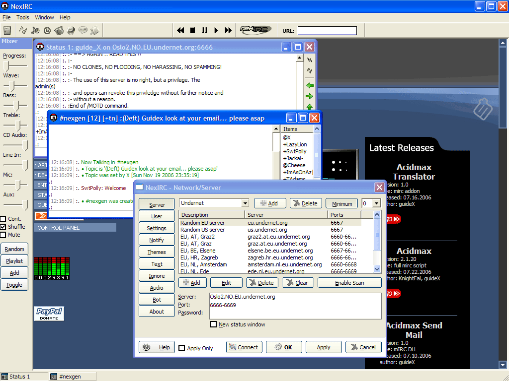



## NexIRC v2\.27

### Description

Multiple status/channels/queries, IRC Server, web browser, secure query, nick completor, system stats, bot features, menu editor, custom scripting system, channel proporties, auto connect, port scanner, url clicker, dcc send/get/chat, download manager, auto join, audio playback, mIRC color codes, identd server, robust options, vbscript support, quick connect, mixer, continuous playback mode, ignore/blacklist system, update check, mIRC servers.ini support. Thanks to various authors on planet source code including Jamie Cabral (NexIRC started from CabralIRC back in 2002)

There's also a much more updated .NET version available, check that out too.
 
### More Info
 

             |
---                |---
**Submitted On**   |2012-03-31 20:15:44
**By**             |[guideX](https://github.com/Planet-Source-Code/PSCIndex/blob/master/ByAuthor/guidex.md)
**Level**          |Intermediate
**User Rating**    |5.0 (15 globes from 3 users)
**Compatibility**  |VB 6\.0
**Category**       |[Internet/ HTML](https://github.com/Planet-Source-Code/PSCIndex/blob/master/ByCategory/internet-html__1-34.md)
**World**          |[Visual Basic](https://github.com/Planet-Source-Code/PSCIndex/blob/master/ByWorld/visual-basic.md)
**Archive File**   |[NexIRC\_v2\_2222363312012\.zip](https://github.com/Planet-Source-Code/guidex-nexirc-v2-27__1-67391/archive/master.zip)

